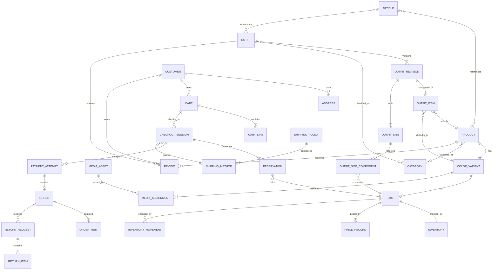

# Canonical data model

Version: 0.1
Status: Baseline for implementation
Authority: ADR-0002, ADR-0003, ADR-0004

This model is conceptual. Prisma names and physical indexes may differ, but
ownership and invariants must not.



## Shared persistence conventions

- IDs are UUIDs generated by the application or database and treated as opaque.
- Timestamps are stored in UTC.
- Optimistic version fields are used where concurrent editorial updates matter.
- Lifecycle entities use `draft`, `published`, or `archived`.
- Historical and ledger records have no delete operation.
- User-visible slugs are unique within resource type and retained through
  redirects after changes.
- Money is integer rial with canonical currency code `IRR`. Toman is a
  presentation conversion only.
- Quantities are non-negative integers.

## Catalog

### Product

Fields: `id`, `name`, `slug`, `description`, `status`, SEO fields,
`createdAt`, `updatedAt`, `archivedAt`, `version`.

### ColorVariant

Fields: `id`, `productId`, `name`, normalized color code, optional display
hex, `status`, `displayOrder`, `createdAt`, `updatedAt`.

### SKU

Fields: `id`, `colorVariantId`, immutable `code`, normalized size code,
display size label, `status`, timestamps.

### PriceRecord

Append-only fields: `id`, `skuId`, `amountRial`, `validFrom`, optional
`validTo`, actor, reason. A fact is never closed or otherwise rewritten after
insertion. `CurrentSkuPrice` is the single authoritative current projection per
SKU and points to the latest applicable fact; `validTo` is only populated when
it is known at insertion time.

### Inventory

Fields: `skuId`, `physicalQuantity`, `reservedQuantity`, `version`,
`updatedAt`.

Constraint:

```text
physicalQuantity >= 0
reservedQuantity >= 0
reservedQuantity <= physicalQuantity
availableQuantity = physicalQuantity - reservedQuantity
```

`availableQuantity` is calculated, never independently written.

### InventoryMovement

Append-only fields: action, quantity delta, before/after physical and reserved
values, actor, reason, correlation ID, optional order/reservation reference,
timestamp, idempotency key.

## Outfit

Published revisions are immutable. OutfitSizeComponent is the authoritative
size mapping and records the exact required SKU and quantity.

An outfit order snapshot includes:

- outfit ID, revision ID, name and selected size;
- charged unit price;
- component SKU code, product/color/size labels and quantity;
- referenced media needed for historical administration.

## Cart and checkout

- Anonymous carts use a high-entropy signed identifier.
- A customer has at most one active server cart per sales channel.
- Guest and authenticated cart merge is one idempotent command.
- Missing lines are added and matching Product SKU quantities are combined.
- Combined quantities are capped at current reservable inventory and produce a
  customer-visible merge notice when reduced.
- Unavailable SKU lines remain with `unavailable` status.
- Outfit Revisions are never automatically replaced; a no-longer-purchasable
  revision enters `requires_review`.
- Cart line status is `available`, `unavailable`, or `requires_review`. Only a
  Cart whose lines are all `available` may enter Checkout.
- Cart prices are informational and not guaranteed.
- CheckoutSession stores a quote snapshot, shipping choice, address snapshot,
  expiry, status, and idempotency key.
- Reservation has explicit `active`, `consumed`, `released`, and `expired`
  states.
- A reservation transition is conditional and idempotent.
- An Outfit reservation expands to its mapped component SKU reservations and
  succeeds or fails atomically.

## Shipping

Shipping configuration is versioned so historical quotes remain reproducible.

### ShippingMethod

Fields: stable code (`iran_post`, `tipax`, `tehran_local_courier`), localized
name, fixed `priceRial`, enabled state, service-area rule, display order, and
configuration version.

Local Courier eligibility requires the selected address to be within Tehran.

### ShippingPolicy

Fields: configuration version, optional `freeShippingThresholdRial`,
eligibility basis, effective timestamp, actor, and audit reason.

The eligibility basis is immutable `order_subtotal`, containing Products and
Outfits only and excluding shipping, discounts, and taxes. A published
configuration cannot be changed in place; updating values produces a new
effective version.

CheckoutSession snapshots:

- shipping method code/name;
- quoted shipping price in IRR;
- free-shipping threshold and eligibility result;
- policy/configuration version;
- immutable address snapshot used for eligibility.

## Payment and order

- PaymentAttempt provider references are unique per provider.
- Raw provider payloads are retained only as permitted, redacted, encrypted if
  sensitive, and never logged verbatim.
- One successful CheckoutSession creates at most one Order.
- Order number is unique, immutable, and separate from internal ID.
- Order, customer, address, price, item and payment facts are snapshots.
- The address snapshot includes recipient, mobile, province, city, postal
  code, address text, and any normalized delivery-zone fields used for the
  quote.
- The Order preserves applied shipping method, shipping price, free-shipping
  decision and policy version.
- Fulfillment state changes append timeline events.

### Milestone 4 physical mapping

- `ShippingPolicyVersion` and `ShippingMethodVersion` are append-only effective
  settings. `CheckoutSession.shippingSettingsVersion` references the applied
  policy version while the session and Order also retain the charged values.
- `CheckoutSession` owns immutable `CheckoutLine` snapshots and
  `InventoryReservation` rows. A partial unique index permits at most one
  `active`, `payment_pending`, or `reconciliation` session per Cart.
- `InventoryReservation` owns the reservation lifecycle; Inventory remains the
  projection of physical and reserved quantities. Reservation/release movements
  have zero physical delta and an exact reserved-quantity transition. Sale
  movements have a non-zero physical delta equal to before/after stock.
- `PaymentAttempt` owns the provider reference and globally unique provider
  transaction identity. `PaymentCallbackReceipt` instead uses provider event
  identity, so ordered status events for one transaction can be retained while
  exact event replay remains unique and fingerprinted.
- `Order` is unique by CheckoutSession, PaymentAttempt, Order Number, and
  provider transaction. `OrderItem`, address, shipping, price, amount and
  payment fields are snapshots and have no update command in Milestone 4.
- `PaymentReconciliation` is unique by provider transaction and records a
  verified provider fact that could not safely become an Order.
- `DatabaseJob` uses a unique idempotency key, pending/leased/completed/failed
  state, lease owner/expiry, attempt count, bounded maximum and safe error.

The database checks non-negative money, positive quantities, valid 30-minute
expiry ordering, `0 <= reserved <= physical`, and movement consistency. The
callback command locks PaymentAttempt then Checkout, consumes reservation and
stock, creates the immutable Order, completes its jobs and records business
events in one transaction.

## Returns and refunds

ReturnRequest records `requestedAt`, the Order delivery-confirmation timestamp,
eligibility deadline, customer condition declarations (`unused`, `unwashed`,
`tagsAttached`), reason, requested items, status, administrator decision,
decision timestamp, and audit context.

A request is eligible only when received no later than 24 hours after confirmed
delivery and all required declarations are true. Return quantities cannot
exceed fulfilled quantity minus already approved returns. Submission does not
restore inventory or recognize a refund. Approval updates return status,
inventory movement, financial record, and business events atomically or
through a recoverable orchestrated workflow.

### Milestone 6 physical mapping

- `Order.version` protects explicit fulfillment commands. `OrderTimelineEvent`
  and `ShipmentTrackingRevision` are append-only facts; delivery time is set
  only by the `shipped -> delivered` command.
- `ReturnRequest` snapshots the delivery instant and inclusive 24-hour
  deadline. `ReturnItem` references immutable Order items and records requested
  quantity; condition declarations and administrator decision facts are never
  inferred from UI state.
- `Refund` is the current provider-neutral projection. Every call is retained
  in `RefundAttempt`; only a provider-confirmed result can complete a return or
  cancellation. Failure and pending-provider results remain retryable and are
  never presented as successful. Confirmed partial-return refunds serialize on
  their shared Order before evaluating whole-Order completion, so exactly one
  final `Delivered -> Returned` fact is appended.
- Approved return and cancellation stock effects append
  `InventoryMovement` rows linked to their source. Outfit effects expand the
  immutable component snapshot and never write an Outfit inventory balance.
- `BulkOperation` and `BulkOperationItem` persist a 30-minute preview,
  before/proposed values and expected projection versions. Apply revalidates
  each target and records an explicit partial failure instead of silently
  widening the requested scope.
- The existing global `CommandReceipt` is the replay guard for every sensitive
  Milestone 6 command. Its primary key is the raw `Idempotency-Key`; it stores
  the namespaced command type, canonical target identity and a SHA-256 hash of
  `{ fingerprintVersion, commandType, target, version, payload }`. Version is
  the submitted optimistic resource version for Order/tracking/bulk commands
  and explicit `null` for unversioned return, refund and inventory commands.
  Application contracts create and read receipts but never update them.
- A command transaction claims its receipt with an insert-on-conflict before
  target locks or domain writes. A concurrent same-key insert waits on the
  global primary key and can proceed only when command type, target and hash
  match. A failed domain transaction rolls its claim back. Provider-bearing
  cancellation, return approval and refund retry are the deliberate exception:
  their preflight transaction commits the receipt and Refund projection before
  the provider call so exact replay cannot call the provider twice. A
  failed/pending result is persisted as a RefundAttempt; recovery uses a
  deliberate new retry key against the same immutable Refund/provider identity.
- Client command keys are validated at 16 to 120 characters. Timeline,
  tracking and inventory facts generated from those commands use a stable
  133-character, domain-separated hash key in their 160-character fact column.
  The disjoint lengths prevent a raw key from colliding with an internally
  derived fact identity. Migration
  `20260804170000_m6_internal_fact_key_namespace` widens the legacy Inventory
  movement key column from 120 to the 160 characters already declared by the
  Prisma model; no historical value is rewritten. Migration
  `20260804171000_m6_command_receipt_immutability` adds a PostgreSQL update
  rejection trigger to the existing receipt table.
- The migration adds database update-rejection triggers to operational fact
  tables. Cleanup/deletion remains unavailable through application contracts;
  production retention or erasure work requires a separately approved policy.

## Audit and business events

Audit events are append-only and contain actor, action, entity type/ID,
correlation ID, timestamp, reason when required, and safe before/after data.
Secrets, OTP codes, authentication tokens, and full payment payloads are
forbidden.

## Required indexes

- Product and Outfit by slug/status.
- ColorVariant by product/display order.
- SKU by code and variant/size uniqueness.
- Active price by SKU.
- Inventory by SKU and low-stock query support.
- Reservation by status/expiry and checkout session.
- PaymentAttempt by provider/reference and checkout session.
- Order by number, customer/date, fulfillment status.
- Shipping method by stable code and effective configuration.
- Return request by order, customer, status and eligibility deadline.
- Audit event by entity, actor, event type, timestamp.
- Search indexes for approved product, outfit, category, and article fields.
