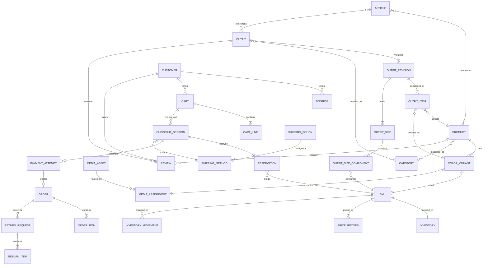

# Canonical data model

Version: 0.1
Status: Baseline for implementation
Authority: ADR-0002, ADR-0003, ADR-0004

This model is conceptual. Prisma names and physical indexes may differ, but
ownership and invariants must not.



## Shared persistence conventions

- IDs are UUIDs generated by the application or database and treated as opaque.
- Timestamps are stored in UTC.
- Optimistic version fields are used where concurrent editorial updates matter.
- Lifecycle entities use `draft`, `published`, or `archived`.
- Historical and ledger records have no delete operation.
- User-visible slugs are unique within resource type and retained through
  redirects after changes.
- Money is integer rial with canonical currency code `IRR`. Toman is a
  presentation conversion only.
- Quantities are non-negative integers.

## Catalog

### Product

Fields: `id`, `name`, `slug`, `description`, `status`, SEO fields,
`createdAt`, `updatedAt`, `archivedAt`, `version`.

### ColorVariant

Fields: `id`, `productId`, `name`, normalized color code, optional display
hex, `status`, `displayOrder`, `createdAt`, `updatedAt`.

### SKU

Fields: `id`, `colorVariantId`, immutable `code`, normalized size code,
display size label, `status`, timestamps.

### PriceRecord

Append-only fields: `id`, `skuId`, `amountRial`, `validFrom`, optional
`validTo`, actor, reason. At most one active price per SKU.

### Inventory

Fields: `skuId`, `physicalQuantity`, `reservedQuantity`, `version`,
`updatedAt`.

Constraint:

```text
physicalQuantity >= 0
reservedQuantity >= 0
reservedQuantity <= physicalQuantity
availableQuantity = physicalQuantity - reservedQuantity
```

`availableQuantity` is calculated, never independently written.

### InventoryMovement

Append-only fields: action, quantity delta, before/after physical and reserved
values, actor, reason, correlation ID, optional order/reservation reference,
timestamp, idempotency key.

## Outfit

Published revisions are immutable. OutfitSizeComponent is the authoritative
size mapping and records the exact required SKU and quantity.

An outfit order snapshot includes:

- outfit ID, revision ID, name and selected size;
- charged unit price;
- component SKU code, product/color/size labels and quantity;
- referenced media needed for historical administration.

## Cart and checkout

- Anonymous carts use a high-entropy signed identifier.
- A customer has at most one active server cart per sales channel.
- Guest and authenticated cart merge is one idempotent command.
- Missing lines are added and matching Product SKU quantities are combined.
- Combined quantities are capped at current reservable inventory and produce a
  customer-visible merge notice when reduced.
- Unavailable SKU lines remain with `unavailable` status.
- Outfit Revisions are never automatically replaced; a no-longer-purchasable
  revision enters `requires_review`.
- Cart line status is `available`, `unavailable`, or `requires_review`. Only a
  Cart whose lines are all `available` may enter Checkout.
- Cart prices are informational and not guaranteed.
- CheckoutSession stores a quote snapshot, shipping choice, address snapshot,
  expiry, status, and idempotency key.
- Reservation has explicit `active`, `consumed`, `released`, and `expired`
  states.
- A reservation transition is conditional and idempotent.
- An Outfit reservation expands to its mapped component SKU reservations and
  succeeds or fails atomically.

## Shipping

Shipping configuration is versioned so historical quotes remain reproducible.

### ShippingMethod

Fields: stable code (`iran_post`, `tipax`, `tehran_local_courier`), localized
name, fixed `priceRial`, enabled state, service-area rule, display order, and
configuration version.

Local Courier eligibility requires the selected address to be within Tehran.

### ShippingPolicy

Fields: configuration version, optional `freeShippingThresholdRial`,
eligibility basis, effective timestamp, actor, and audit reason.

The eligibility basis is immutable `order_subtotal`, containing Products and
Outfits only and excluding shipping, discounts, and taxes. A published
configuration cannot be changed in place; updating values produces a new
effective version.

CheckoutSession snapshots:

- shipping method code/name;
- quoted shipping price in IRR;
- free-shipping threshold and eligibility result;
- policy/configuration version;
- immutable address snapshot used for eligibility.

## Payment and order

- PaymentAttempt provider references are unique per provider.
- Raw provider payloads are retained only as permitted, redacted, encrypted if
  sensitive, and never logged verbatim.
- One successful CheckoutSession creates at most one Order.
- Order number is unique, immutable, and separate from internal ID.
- Order, customer, address, price, item and payment facts are snapshots.
- The address snapshot includes recipient, mobile, province, city, postal
  code, address text, and any normalized delivery-zone fields used for the
  quote.
- The Order preserves applied shipping method, shipping price, free-shipping
  decision and policy version.
- Fulfillment state changes append timeline events.

## Returns and refunds

ReturnRequest records `requestedAt`, the Order delivery-confirmation timestamp,
eligibility deadline, customer condition declarations (`unused`, `unwashed`,
`tagsAttached`), reason, requested items, status, administrator decision,
decision timestamp, and audit context.

A request is eligible only when received no later than 24 hours after confirmed
delivery and all required declarations are true. Return quantities cannot
exceed fulfilled quantity minus already approved returns. Submission does not
restore inventory or recognize a refund. Approval updates return status,
inventory movement, financial record, and business events atomically or
through a recoverable orchestrated workflow.

## Audit and business events

Audit events are append-only and contain actor, action, entity type/ID,
correlation ID, timestamp, reason when required, and safe before/after data.
Secrets, OTP codes, authentication tokens, and full payment payloads are
forbidden.

## Required indexes

- Product and Outfit by slug/status.
- ColorVariant by product/display order.
- SKU by code and variant/size uniqueness.
- Active price by SKU.
- Inventory by SKU and low-stock query support.
- Reservation by status/expiry and checkout session.
- PaymentAttempt by provider/reference and checkout session.
- Order by number, customer/date, fulfillment status.
- Shipping method by stable code and effective configuration.
- Return request by order, customer, status and eligibility deadline.
- Audit event by entity, actor, event type, timestamp.
- Search indexes for approved product, outfit, category, and article fields.
